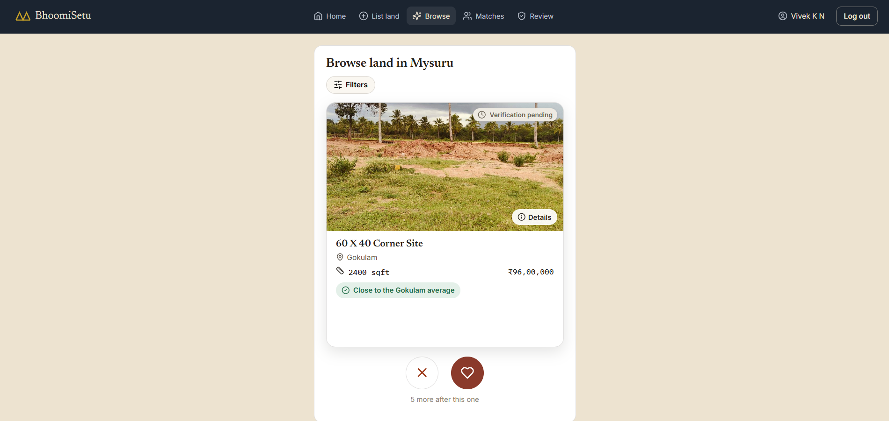
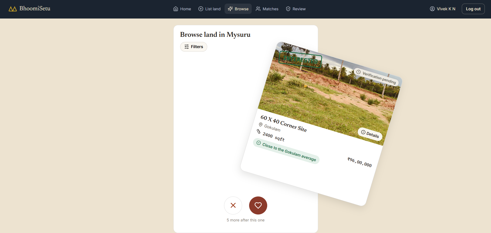
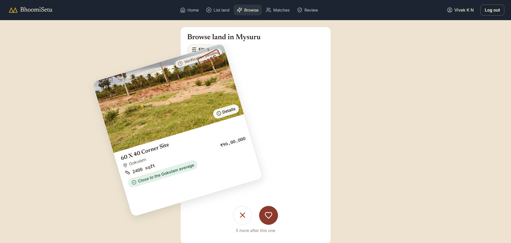
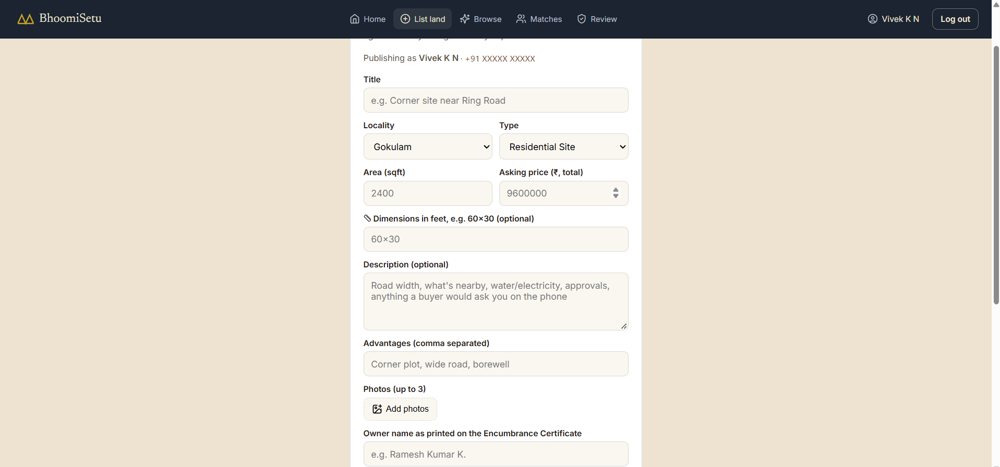
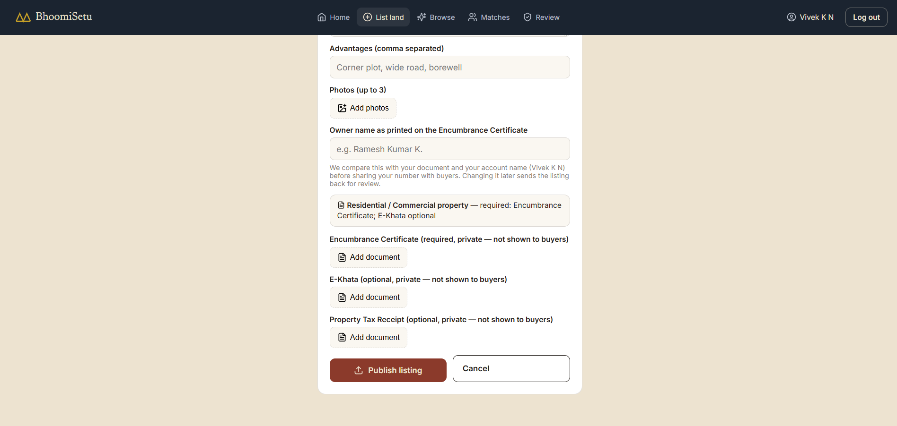
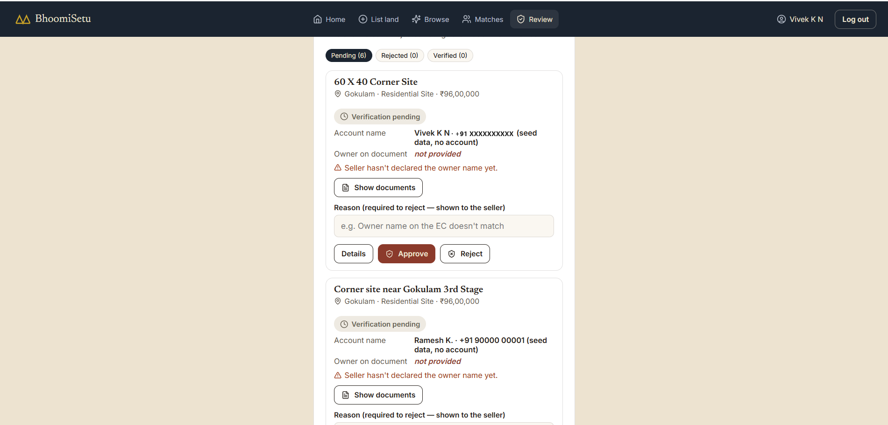

# BhoomiSetu

**A direct land marketplace for Mysuru — no agents in the middle.**

Sellers list land, buyers swipe to shortlist, and every asking price is
checked against nearby listings before it's shown. Ownership is verified
against property documents before a seller's phone number is ever shared.


**Built with:** React 18 + Vite · Supabase (Postgres, Auth, Storage, Edge Functions) · lucide-react icons

---

## Contents

- [Features](#features)
  - [Browse and swipe](#browse-and-swipe)
  - [List your land](#list-your-land)
  - [Owner verification (admin review)](#owner-verification-admin-review)
- [Run it on your device](#run-it-on-your-device)
- [Folder structure](#folder-structure)
- [What's real vs. not built yet](#whats-real-vs-not-built-yet)

---

## Features

### Browse and swipe

Buyers see one listing at a time as a card: photo, locality, size, price
and a **price check** badge that compares the ₹/sqft against other listings
in the same locality ("Close to the Gokulam average", "Higher than
nearby", …). Filters narrow by locality, property type, price band or
verified-only. Tap **Details** for all photos, the description and the
full price breakdown.



Swipe (or tap the buttons) **right** to shortlist, **left** to pass.
Shortlisted listings appear under **Matches**.

| Swipe right — interested | Swipe left — pass |
|---|---|
|  |  |

### List your land

The **List land** tab is a seller dashboard: your listings with Edit /
Delete and a count of interested buyers (a count only — buyer identities
are never shown to sellers). The form takes locality, type, area (or
dimensions like `60x30`, converted to sqft automatically), asking price,
description, advantages and up to 3 photos. A live price check shows how
your price compares to the locality before you publish.



Documents are **private** — only admins can open them, never buyers. Which
ones are required depends on the property type:

| Property type | Required | Optional |
|---|---|---|
| Residential Site / Commercial Plot | Encumbrance Certificate | E-Khata, Property Tax Receipt |
| Agricultural Land | Encumbrance Certificate + RTC | Property Tax Receipt |

These are property-proof documents only — the app deliberately never asks
for personal ID (Aadhaar/PAN).



### Owner verification (admin review)

To keep agents out, each seller declares the **owner name exactly as
printed on the EC/RTC**. An admin compares it against the uploaded
document and the seller's account name on the **Review** page, then
approves or rejects (with a reason shown to the seller).

- **Pending** listings still appear in Browse (with a badge) and can be
  shortlisted, but the seller's number stays hidden.
- **Verified** listings unlock the seller's number for buyers who swiped
  right.
- **Rejected** listings are hidden from Browse.

This is enforced by the database (row-level security + triggers), not
just hidden in the UI. Changing the locality, type, size, owner name or
uploading a new EC/Khata/RTC sends a listing back for review.



---

## Run it on your device

### 1. Prerequisites

- **[Node.js](https://nodejs.org) 20.19+ or 22.12+** (the LTS installer is
  fine) — check with `node -v`
- **[Git](https://git-scm.com)** (or download the project as a ZIP)
- A free **[Supabase](https://supabase.com)** account — the app needs a
  real database and won't start without one

### 2. Get the code and install

```bash
git clone https://github.com/VivekKN001/BhoomiSetu.git bhoomisetu
cd bhoomisetu
npm install
```

### 3. Set up the Supabase database (one-time)

1. Create a new project at [supabase.com](https://supabase.com).
2. **SQL Editor → New query** → paste the contents of `sql/schema.sql` →
   **Run**. This creates every table, the two storage buckets
   (`land-images` public, `land-documents` private) and all access
   policies.
   > Already ran `schema.sql` on an older version? Run only the files in
   > `sql/migrations/` that you haven't run yet, in number order — they
   > upgrade the schema without wiping your listings.
3. **Authentication → Providers → Email** → turn **off** "Confirm email".
   (Login is mobile number + password, implemented on top of Supabase's
   email auth with an address nobody ever emails — see
   [What's real](#whats-real-vs-not-built-yet). Without this, signups
   never complete.)
4. *(Optional)* Run `sql/seed.sql` the same way for 5 sample listings.

### 4. Connect the app to your database

Copy the example env file:

```bash
cp .env.example .env        # Windows PowerShell: Copy-Item .env.example .env
```

Then in Supabase go to **Project Settings → API** and paste into `.env`:

```
VITE_SUPABASE_URL=https://<your-project-ref>.supabase.co
VITE_SUPABASE_ANON_KEY=<your anon public key>
```

### 5. Start it

```bash
npm run dev
```

Open **http://localhost:5173** and sign up with your name, mobile number
and a password. **Save the recovery code** shown after signup — it's the
only way to reset a forgotten password.

**On your phone:** run `npm run dev -- --host` instead, make sure the phone
is on the same Wi-Fi, and open the `Network:` address Vite prints
(e.g. `http://192.168.1.5:5173`).

### 6. Make yourself an admin *(to see the Review tab)*

After signing up, run this in the SQL Editor with your 10-digit number:

```sql
insert into admins (user_id)
  select id from auth.users where email = '91XXXXXXXXXX@bhoomisetu.local';
```

Log out and back in — a **Review** tab appears. There is deliberately no
in-app way to become an admin.

### 7. Enable forgot-password *(optional)*

Recovery codes are issued by a Supabase Edge Function:

```bash
npx supabase login
npx supabase link --project-ref <your-project-ref>   # from your dashboard URL
npx supabase functions deploy account-recovery
```

Without it, signup and login still work, but no recovery codes are
issued, so forgot-password can't work.

### Other commands

```bash
npm run build     # production build into dist/
npm run preview   # serve the production build locally
```

---

## Folder structure

```
bhoomisetu/
├── index.html
├── package.json
├── vite.config.js
├── .env.example              # copy to .env, fill in real values
├── docs/screenshots/         # images used in this README
├── sql/
│   ├── schema.sql             # full schema, run once for a fresh project
│   ├── seed.sql               # optional sample listings
│   └── migrations/            # upgrades for a project that already ran schema.sql
│       ├── 002_add_phone_auth.sql
│       ├── 003_add_listing_edit_delete_policies.sql
│       ├── 004_add_typed_documents_and_dimensions.sql
│       ├── 005_add_verification_contacts_recovery_codes.sql
│       └── 006_require_encumbrance_certificate.sql
├── supabase/
│   └── functions/
│       └── account-recovery/   # Edge Function: forgot-password via recovery code
└── src/
    ├── main.jsx
    ├── App.jsx                 # top-level view switcher + data loading + auth gating
    ├── index.css
    ├── data/
    │   ├── localities.js
    │   └── propertyTypes.js    # property types + which documents each requires
    ├── lib/
    │   ├── supabaseClient.js    # creates the Supabase client from .env
    │   ├── auth.js              # ALL Supabase Auth calls go through here
    │   ├── storage.js           # ALL database/storage calls go through here
    │   ├── pricing.js           # ₹/sqft math + the price-fairness check
    │   ├── image.js             # placeholder photo for listings with no upload
    │   ├── dimensions.js        # "60x30" -> area
    │   └── nameMatch.js         # advisory owner-name vs account-name check
    └── components/
        ├── Header.jsx
        ├── Marquee.jsx          # scrolling photo strip (mobile home)
        ├── TrussDivider.jsx
        ├── SideRail.jsx
        ├── Badge.jsx            # price-check + verification badges
        ├── ListingDetail.jsx    # full listing sheet: all photos, description
        ├── RecoveryCodeModal.jsx
        ├── HomeView.jsx
        ├── AuthView.jsx         # login / sign up / forgot password
        ├── SellView.jsx         # your listings dashboard + create/edit form
        ├── BuyView.jsx          # swipe card stack + filters
        ├── MatchesView.jsx      # shortlisted land + unlocked contacts
        ├── ProfileView.jsx      # name, password, recovery code
        └── ReviewView.jsx       # admin-only ownership review queue
```

---

## What's real vs. not built yet

**Real**

- Listings, photos and documents live in a real Postgres database + file
  storage, shared across every device connected to your Supabase project.
- Real accounts: full name + mobile number + password. Under the hood it's
  Supabase email+password auth with a synthetic, never-emailed address
  derived from the phone number (`919000000001@bhoomisetu.local`) —
  Supabase's native phone login needs a paid SMS provider, even without
  OTP, so this keeps the login screen phone-only at zero cost.
- Forgot-password via a one-time **recovery code** (shown at signup,
  regenerable from the Profile page), since there's no SMS or email to
  send a reset link to.
- Owner verification with document review, enforced by the database.
- Calling a matched seller is a real `tel:` link that opens the phone's
  dialer.

**Not built yet**

- Masked/anonymized calling — once unlocked, the buyer sees the seller's
  real number.
- Automatic photo classification (land / house / agricultural / not
  suitable) — planned as a proper ML model.
- Payments / token-advance escrow (needs a licensed escrow partner).
- Changing your mobile number (it *is* your login), and recovering an
  account if both the password and recovery code are lost.
- Replacing or deleting a document leaves the old file in storage (the
  app can never read documents back to find its path).

See [`CLAUDE.md`](CLAUDE.md) for the reasoning behind each database and
security decision.
